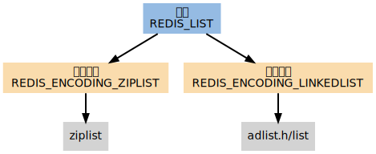

# 双端链表

https://redisbook.readthedocs.io/en/latest/internal-datastruct/adlist.html

链表作为数组之外的一种常用序列抽象，是大多数高级语言的基本数据类型，因为 C 语言本身不支持链表类型，大部分 C 程序都会自己实现一种链表类型，Redis 也不例外 -- 实现了一个双端链表

## 双端链表在 Redis 中的应用
* 事务模块使用双端链表依序保存输入的命令；
* 服务器模块使用双端链表来保存多个客户端；
* 订阅/发送模块使用双端链表来保存订阅模式的多个客户端；
* 事件模块使用双端链表来保存时间事件（time event）；

## 列表

Redis 列表使用两种数据结构作为底层实现：

1. 双端链表
2. 压缩列表

因为双端链表占用的内存比压缩列表要多，所以当创建新的列表键时，列表会优先考虑使用压缩列表作为实现，并且在有需要的时候，才从压缩列表实现转换到双端链表实现

### 编码的选择
创建新列表时 Redis 默认使用 REDIS_ENCODING_ZIPLIST 编码， 当以下任意一个条件被满足时， 列表会被转换成 REDIS_ENCODING_LINKEDLIST 编码：

* 试图往列表新添加一个字符串值，且这个字符串的长度超过 server.list_max_ziplist_value （默认值为 64 ）。
* ziplist 包含的节点超过 server.list_max_ziplist_entries （默认值为 512 ）。