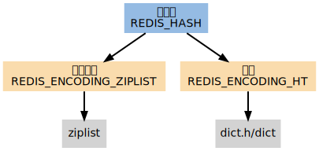

# 字典

如果一个集合使用 REDIS_ENCODING_INTSET 编码， 那么当以下任何一个条件被满足时， 这个集合会被转换成 REDIS_ENCODING_HT 编码：

* intset 保存的整数值个数超过 server.set_max_intset_entries （默认值为 512 ）。
* 试图往集合里添加一个新元素，并且这个元素不能被表示为 long long 类型（也即是，它不是一个整数）。