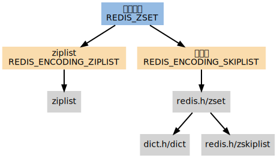
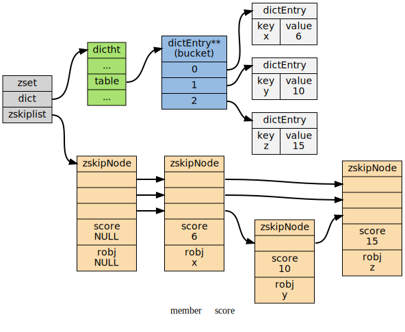

# skiplist

跳跃表（skiplist）是一种有序数据结构，它通过在每个节点中维持多个指向其他节点的指针，从而达到快速访问节点的目的。


此目录的代码是从 server.h t_zset.h 中剥离出来的


## Redis 使用跳跃表作为有序集合键的底层实现之一

和字典、链表或者字符串这几种在 Redis 中大量使用的数据结构不同，跳跃表在 Redis 的唯一作用， 就是实现有序集数据类型。
跳跃表将指向有序集的 score 值和 ele 域的指针作为元素， 并以 score 值为索引， 对有序集元素进行排序。

REDIS_ZSET （有序集）是 ZADD 、 ZCOUNT 等命令的操作对象， 它使用 REDIS_ENCODING_ZIPLIST 和 REDIS_ENCODING_SKIPLIST 两种方式编码：


### 编码的选择
在通过 ZADD 命令添加第一个元素到空 key 时， 程序通过检查输入的第一个元素来决定该创建什么编码的有序集。

如果第一个元素符合以下条件的话， 就创建一个 REDIS_ENCODING_ZIPLIST 编码的有序集：

  * 服务器属性 server.zset_max_ziplist_entries 的值大于 0 （默认为 128 ）。
  * 元素的 member 长度小于服务器属性 server.zset_max_ziplist_value 的值（默认为 64 ）。
否则，程序就创建一个 REDIS_ENCODING_SKIPLIST 编码的有序集。

### 编码的转换
对于一个 REDIS_ENCODING_ZIPLIST 编码的有序集， 只要满足以下任一条件， 就将它转换为 REDIS_ENCODING_SKIPLIST 编码：

ziplist 所保存的元素数量超过服务器属性 server.zset_max_ziplist_entries 的值（默认值为 128 ）
新添加元素的 member 的长度大于服务器属性 server.zset_max_ziplist_value 的值（默认值为 64 ）

### SKIPLIST 编码的有序集

当使用 REDIS_ENCODING_SKIPLIST 编码时， 有序集元素由 redis.h/zset 结构来保存：

/* 有序集 */
```
typedef struct zset {

    // 字典
    dict *dict;

    // 跳跃表
    zskiplist *zsl;

} zset;
```
zset 同时使用字典和跳跃表两个数据结构来保存有序集元素。

其中， 元素的成员由一个 redisObject 结构表示， 而元素的 score 则是一个 double 类型的浮点数， 字典和跳跃表两个结构通过将指针共同指向这两个值来节约空间 （不用每个元素都复制两份）。

下图展示了一个 REDIS_ENCODING_SKIPLIST 编码的有序集：



通过使用字典结构， 并将 member 作为键， score 作为值， 有序集可以在 O(1) 复杂度内：

检查给定 member 是否存在于有序集（被很多底层函数使用）；
取出 member 对应的 score 值（实现 ZSCORE 命令）。
另一方面， 通过使用跳跃表， 可以让有序集支持以下两种操作：

在 O(logN) 期望时间、 O(N) 最坏时间内根据 score 对 member 进行定位（被很多底层函数使用）；
范围性查找和处理操作，这是（高效地）实现 ZRANGE 、 ZRANK 和 ZINTERSTORE 等命令的关键。
通过同时使用字典和跳跃表， 有序集可以高效地实现按成员查找和按顺序查找两种操作。