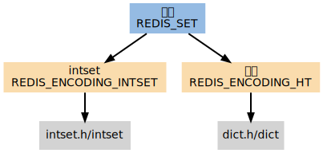

# intset

整数集合 （intset) 是Redis用于保存整数值的集合抽象数据结构，它可以保存类型为 int16_t、int32_t、int64_t 的整数值，并且保证集合中不会出现重复元素。

## 集合编码的选择

第一个添加到集合的元素， 决定了创建集合时所使用的编码：

如果第一个元素可以表示为 long long 类型值（也即是，它是一个整数）， 那么集合的初始编码为 REDIS_ENCODING_INTSET 。
否则，集合的初始编码为 REDIS_ENCODING_HT 。

Intset 是集合键的底层实现之一，如果一个集合：

* 只保存着整数元素；
* 元素的数量不多；  
那么 Redis 就会使用 intset 来保存集合元素。

## 编码的切换

如果一个集合使用 REDIS_ENCODING_INTSET 编码， 那么当以下任何一个条件被满足时， 这个集合会被转换成 REDIS_ENCODING_HT 编码：

* intset 保存的整数值个数超过 server.set_max_intset_entries （默认值为 512 ）。
* 试图往集合里添加一个新元素，并且这个元素不能被表示为 long long 类型（也即是，它不是一个整数）。

